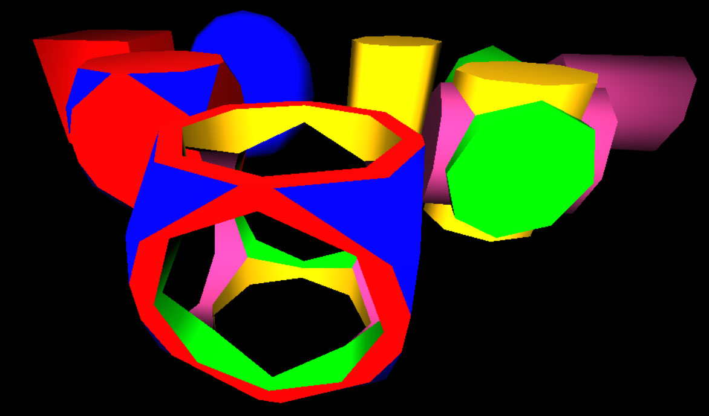

# THREE-CSGMesh

This repo is originally forked from https://github.com/manthrax/THREE-CSGMesh which contains work,
- Copyright 2011 Evan Wallace (http://madebyevan.com/), MIT license.
- Copyright 2020 Michael Schlachter (https://github.com/manthrax), MIT license.

My modifications,

- Started with CSGMesh.js from https://github.com/manthrax/THREE-CSGMesh/blob/master/CSGMesh.js
- Converted to TypeScript by adding type annotations to all variables
- Converted `var` to `const` and `let`
- More THREEJS integration (THREE r121)
- Much Refactoring
- New GitHub repo
- Working Examples
- support for three r125

## Constructive Solid Geometry

Perform binary operations on mesh geometries. Works with geometries of base type THREE.Geometry and THREE.BufferGeometry.

- [Union](#Union) : Return a new CSG solid consisting of A and B
- [Subtract](#Subtract) : Return a new CSG solid where B is subtracted from A
- [Intersect](#Intersect) : Return a new CSG solid where both A and B overlap

Example 1 : https://sbcode.net/threejs/csg/

Example 2 : https://sbcode.net/threejs/engraving/



```bash
git clone https://github.com/Sean-Bradley/THREE-CSGMesh.git
cd THREE-CSGMesh
npm install
npm run dev
```

Visit http://127.0.0.1:3000

This is a TypeScript project consisting of two sub projects with there own tsconfigs.

To edit this example, then modify the files in `./src/client/` or `./src/server/`. The projects will auto recompile if you started by using `npm run dev`

or

You can simply just import the generated `./dist/client/CSGMesh.js` directly into your project as a module.

```html
<script type="module" src="./CSGMesh.js"></script>
```

or as ES6 import

```typescript
import CSG from './CSGMesh.js'
```


### Union

Return a new CSG solid consisting of A and B

    A.union(B)

    +-------+            +-------+
    |       |            |       |
    |   A   |            |       |
    |    +--+----+   =   |       +----+
    +----+--+    |       +----+       |
         |   B   |            |       |
         |       |            |       |
         +-------+            +-------+

### Subtract

Return a new CSG solid where B is subtracted from A

    A.subtract(B)

    +-------+            +-------+
    |       |            |       |
    |   A   |            |       |
    |    +--+----+   =   |    +--+
    +----+--+    |       +----+
         |   B   |
         |       |
         +-------+

### Intersect

Return a new CSG solid where both A and B overlap

    A.intersect(B)

    +-------+
    |       |
    |   A   |
    |    +--+----+   =   +--+
    +----+--+    |       +--+
         |   B   |
         |       |
         +-------+


## Threejs TypeScript Course

Visit https://github.com/Sean-Bradley/Three.js-TypeScript-Boilerplate for a Threejs TypeScript boilerplate containing many extra branches that demonstrate many examples of Threejs.

> To help support this Threejs example, please take a moment to look at my official Threejs TypeScript course at 

[](https://www.udemy.com/course/threejs-tutorials/?referralCode=4C7E1DE91C3E42F69D0F)

  [Three.js and TypeScript](https://www.udemy.com/course/threejs-tutorials/?referralCode=4C7E1DE91C3E42F69D0F)<br/>  
  Discount Coupons for all my courses can be found at [https://sbcode.net/coupons](https://sbcode.net/coupons)
